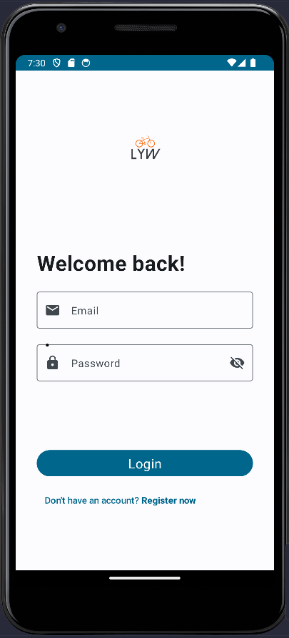

<div align="center">
  
  <h3 align="center">Lead Your Way - Bike Rental App</h3>
  <p>Navi Buddy · 2023-02</p>
</div>

---

Welcome to **Lead Your Way** , your go-to bike rental app for a convenient, efficient, and enjoyable cycling experience.

## About Lead Your Way

Lead Your Way is a digital platform designed to simplify bike rentals for all types of cyclists. Whether you're a sports enthusiast looking for a thrilling ride or someone in need of efficient urban mobility, our app offers a wide range of features and benefits to enhance your cycling journey.

## Authors

This project was developed by the following team members:

-   Oliver Tuesta - GitHub: [oliverTuesta](https://github.com/oliverTuesta)
-   Andres Leiva - GitHub: [aleiva17](https://github.com/aleiva17)
-   Lorenzo Navarro - GitHub: [codelinzer](https://github.com/codelinzer)
-   Josue Ramos - GitHub: [Blo0m](https://github.com/Blo0m)
-   Lucas Ruiz - GitHub: [lucas1336](https://github.com/lucas1336)

## Screenshots




## Getting Started

These instructions will help you get a copy of the project up and running on your local machine for development and testing purposes.

### Prerequisites

-   Android Studio: You will need to have Android Studio installed on your computer.
-   Kotlin: Ensure that you have Kotlin set up in your development environment.

### Installation

1. Clone the repository to your local machine:

    ```bash
    git clone https://github.com/your-repo-url.git

    ```

2. Open the project in Android Studio.
